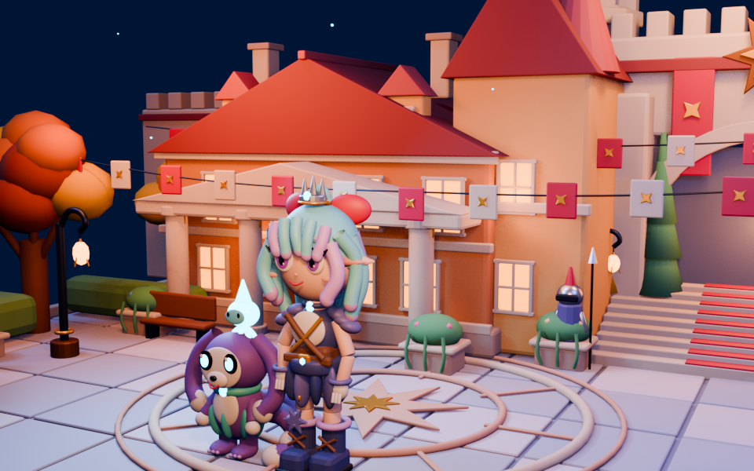
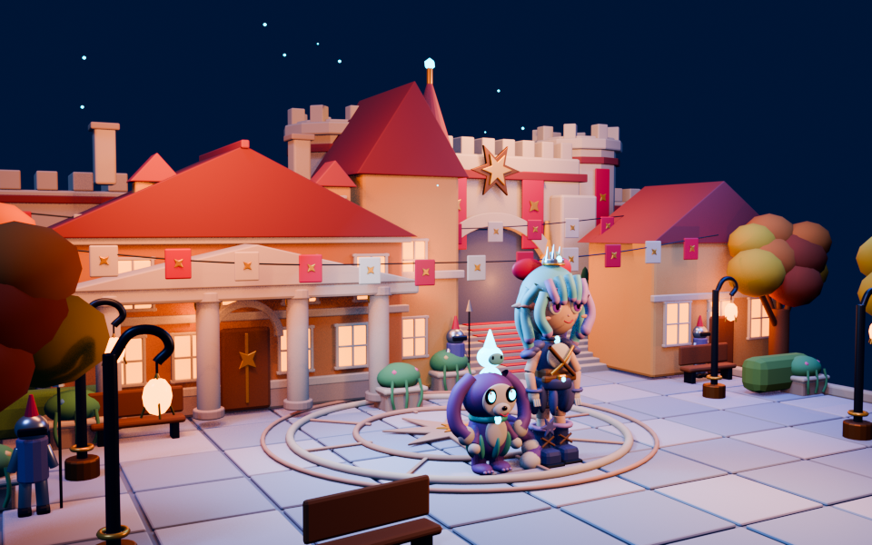
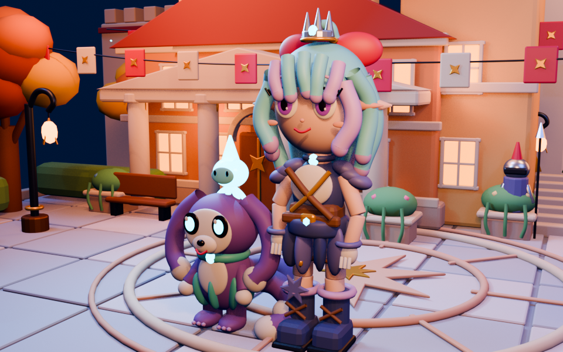

# 洛克王国幻想广场 Blender 场景 (Rock Kingdom Fantasy Plaza 3D Scene)

基于参考截图通过程序化生成与建模还原的洛克王国夜景幻想广场 Blender 3D 场景项目。

## 场景特色

- **卡通 PBR 渲染风格**：低噪声节点材质、暖色建筑与灯火、冷蓝月光夜空、红瓦与米白石材、秋季植被。
- **完整场景元素**：
  - 前景主广场：中央星形徽记与环形铺装、旋涡纹灯柱、花箱与秋树。
  - 左后方公馆：包含门廊、塔楼、山墙、烟囱与发光窗户。
  - 右后方城门：双塔、大型拱券、城垛、红金垂旗与阶梯。
  - 中心角色与宠物：Q版比例主角、分层发型、服装细节、独立骨架与陪伴宠物。
- **模块化构建脚本**：包含从空白场景逐步构建场景各个部分的 Python 脚本（`scripts/`）。

## 目录结构

- `rock_kingdom_fantasy_plaza.blend` - 核心 Blender 3D 场景文件
- `scripts/` - 场景生成、材质修复、灯光渲染等构建脚本
- `renders/` - 渲染输出效果图（广角、主镜头、角色特写）
- `references/` - 原始参考截图
- `docs/` - 场景设计规格与实现计划文档
- `tests/` - 场景契约测试与验证脚本

## 渲染预览

| 全景主视角 (`final_hero.png`) | 广场广角 (`plaza_wide.png`) | 角色特写 (`character_closeup.png`) |
| :---: | :---: | :---: |
|  |  |  |
